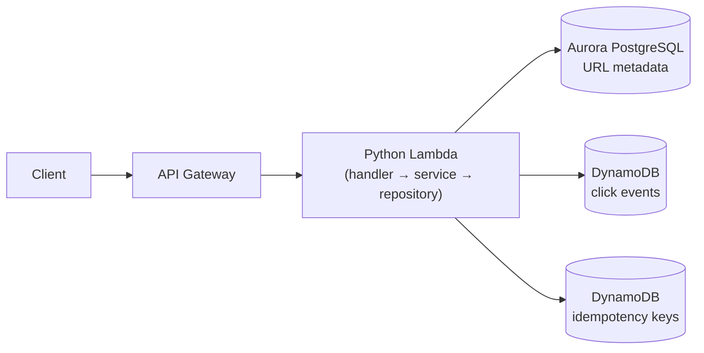

# Serverless URL Shortener & Analytics Platform

[](https://www.python.org/downloads/)
[](LICENSE)

A production-shaped serverless URL shortener built with Python and AWS. Shorten URLs via a REST API, get 302 redirects with click analytics, and survive retried requests with DynamoDB-backed idempotency — all behind a clean handler → service → repository architecture with swappable storage backends.

## Features

- **REST API** — `POST /shorten`, `GET /{code}`, `GET /analytics/{code}`, `GET /health`
- **Safe retries** — `Idempotency-Key` header support; repeated `POST /shorten` calls return the original short URL instead of minting duplicates (conditional DynamoDB writes win concurrent races correctly)
- **Expiring links** — optional ISO-8601 `expires_at`; validated at creation, enforced on redirect
- **Click analytics** — every redirect records user agent, referrer, and timestamp
- **Swappable backends** — URL metadata on memory or PostgreSQL; analytics and idempotency on memory or DynamoDB, selected by environment variables
- **44 automated tests** — unit, handler, and live DynamoDB tests (via moto), all green in CI

## Architecture



The Lambda is stateless: URL metadata lives in PostgreSQL (relational integrity, uniqueness), while high-volume click events and ephemeral idempotency keys live in DynamoDB (key-based access, TTL expiry). Local development swaps in thread-safe in-memory repositories — no AWS credentials needed to run the suite.

## API

### `POST /shorten` — create a short URL

```bash
curl -X POST https://<api>/shorten \
  -H 'Content-Type: application/json' \
  -H 'Idempotency-Key: 550e8400-e29b-41d4-a716-446655440000' \
  -d '{"url": "https://example.com/very/long/path", "expires_at": "2027-01-01T00:00:00Z"}'
```

```json
{
  "short_code": "Y9Jltti",
  "original_url": "https://example.com/very/long/path",
  "created_at": "2026-10-02T15:33:34.436330+00:00",
  "expires_at": "2027-01-01T00:00:00+00:00"
}
```

- `url` (required) must be a valid `http(s)` URL.
- `expires_at` (optional) must be a future ISO-8601 datetime.
- `Idempotency-Key` (optional header): retry safely — the same key always returns the originally created record.

### `GET /{short_code}` — redirect

Returns `302` with a `Location` header and records a click event. Unknown or expired codes return `404`.

### `GET /analytics/{short_code}` — click events

```json
{ "short_code": "Y9Jltti", "clicks": 1, "events": [ ... ] }
```

### `GET /health` — service health

Reports status plus stored URL and click-event counts.

## Backends

| Concern | Variable | Options | Default |
|---|---|---|---|
| URL metadata | `STORAGE_BACKEND` | `memory` \| `postgres` | `memory` |
| Click analytics | `ANALYTICS_BACKEND` | `memory` \| `dynamodb` | `memory` |
| Idempotency keys | `IDEMPOTENCY_BACKEND` | `memory` \| `dynamodb` | `memory` |

Supporting variables: `DATABASE_URL`, `DYNAMODB_CLICK_TABLE`, `DYNAMODB_IDEMPOTENCY_TABLE`, `IDEMPOTENCY_TTL_SECONDS`. See [`.env.example`](.env.example). The SAM template wires the deployed Lambda to DynamoDB for analytics and idempotency automatically.

## Project structure

```text
src/
  handler.py            # Lambda entrypoint: routing, responses, Idempotency-Key header
  services.py           # Business logic: validation, code generation, expiry, idempotency
  factory.py            # Backend selection from environment variables
  models.py             # URLRecord / ClickEvent dataclasses
  repositories/
    memory.py           # Thread-safe in-memory backends (local dev + tests)
    postgres.py         # Aurora PostgreSQL URL repository
    dynamodb.py         # DynamoDB click-event repository
    idempotency.py      # Idempotency-key repositories (memory + DynamoDB)
tests/                  # 44 tests: services, handler, repositories, factory,
                        # idempotency incl. race conditions, expiry, live DynamoDB (moto)
template.yaml           # SAM: Lambda + API Gateway + 2 DynamoDB tables (TTL, on-demand)
migrations/             # Liquibase changelog (expand → migrate → contract)
docs/FAILURE_MODES.md   # Failure analysis: timeouts, throttling, partial failures
DESIGN.md               # System design notes
BENCHMARKS.md           # Benchmark harness (populated from real runs only)
```

## Run it locally

No AWS credentials required:

```bash
python3 -m venv .venv && source .venv/bin/activate
pip install -r requirements-dev.txt
pytest -q            # 44 passed
python3 local_demo.py  # end-to-end smoke test
```

## Deploy to AWS

```bash
sam build
sam deploy --guided   # provisions Lambda, API Gateway, DynamoDB tables
```

Set `STORAGE_BACKEND=postgres` and `DATABASE_URL` to move URL metadata to Aurora PostgreSQL (see [`migrations/`](migrations/)).

## Engineering notes

- **Idempotency races**: the DynamoDB idempotency write is conditional (`attribute_not_exists`); a `KeyError` on save means a concurrent request won, so the loser re-reads and returns the winner's record.
- **Short codes**: 7 chars from `secrets` (62⁷ ≈ 3.5T combinations), with bounded collision retries.
- **Expiry**: normalized to UTC at creation; the redirect path re-checks so rows that expired after creation can't be served, and expired hits aren't counted as clicks.
- **Failure modes** are documented in [`docs/FAILURE_MODES.md`](docs/FAILURE_MODES.md) — Lambda timeouts, DynamoDB throttling, partial failures, and how each is handled.

## Roadmap

- Rate limiting per API key
- Custom short-code aliases
- p50/p95/p99 benchmarks from real load runs ([`BENCHMARKS.md`](BENCHMARKS.md))
- Frontend dashboard for analytics

## License

[MIT](LICENSE)
